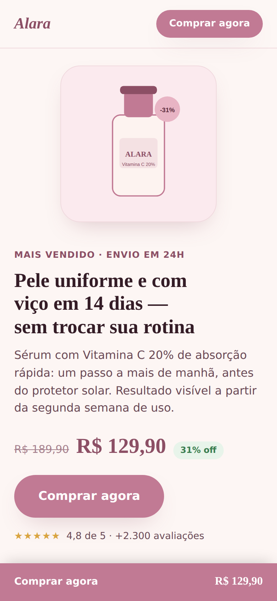

# Página de Venda pra Tráfego Pago (produto único)

Projeto de portfólio: uma página de venda de um produto único, pensada
pra receber tráfego pago (anúncios no Instagram/Facebook ou Google
Ads) — diferente do [projeto 2](https://github.com/jvtdemiranda/landing-prestador-servico)
(landing page institucional, pra captar contato via WhatsApp), aqui o
objetivo é **converter direto em venda**, no estilo de página de
produto de e-commerce (Nuvemshop, Loja Integrada, Shopify).

**Publicado em [landing-produto-trafego-pago.vercel.app](https://landing-produto-trafego-pago.vercel.app)**
— atualiza sozinho a cada push na `main`.

<p align="center">
  
  
</p>

> **Em resumo (pra quem não é da área técnica):** esta é a página que
> um anúncio pago leva a pessoa até, no momento de decidir a compra —
> diferente de um site institucional, ela é construída só pra vender
> um produto específico, com prova social, resposta às dúvidas mais
> comuns e um botão de compra sempre visível. Também registra de qual
> anúncio cada visitante veio, informação que a loja usa pra saber
> quais anúncios realmente estão vendendo.

## Por que esse projeto (e por que agora)

Pesquisei vagas reais no Workana e 99Freelas e achei duas que bateram
direto com esse nicho: uma pedindo **landing page pra loja na Nuvem
Shop**, outra pedindo um e-commerce de cosméticos "pronto pra tráfego
pago", com a estrutura exata que usei aqui (headline, benefícios,
prova social, quebra de objeção, CTA). Escolhi cosméticos como
produto fictício por ser o nicho mais recorrente encontrado.

## O que é "tráfego pago" (resumo dos conceitos aplicados aqui)

Tráfego pago é pagar pra alguém ver seu produto — anúncio no
Instagram, Facebook ou Google. A pessoa clica no anúncio e cai nesta
página. Como cada clique custou dinheiro, a página não pode
"desperdiçar" a visita — e isso muda como ela precisa ser construída.
Três conceitos, aplicados de verdade no código:

- **UTM** (`js/script.js`, função `capturarUtm`) — o link do anúncio
  chega com parâmetros como `?utm_source=instagram&utm_campaign=...`;
  a página lê isso, guarda durante a visita (`sessionStorage`) e
  anexa no link de compra — é assim que a loja sabe qual anúncio
  gerou qual venda. Teste abrindo a página com
  `?utm_source=instagram&utm_campaign=teste` na URL — aparece um selo
  "Você veio de: instagram" no canto da tela.
- **Pixel do Meta** (comentário no `<head>` do `index.html` e função
  `rastrearCliqueComprar` no JS) — não conectei um Pixel de verdade
  (exigiria uma conta de anúncio real), mas deixei documentado
  exatamente onde e quando ele seria chamado: no clique do botão
  "Comprar agora", como evento `InitiateCheckout`. É esse sinal que o
  algoritmo do Instagram usa pra achar mais gente parecida com quem
  realmente compra.
- **Página contextual ao anúncio** — um erro comum é a página "quebrar
  a promessa" do anúncio (prometer uma coisa no anúncio, mostrar outra
  na página) — isso aumenta a taxa de abandono. Por isso a headline
  segue a fórmula de 3 sinais (quem é o público, o que ganha, por que
  aqui), pra manter a mesma linguagem que o anúncio usaria.

## Estrutura

```
landing-produto-trafego-pago/
├── README.md
├── docs/              -> screenshots usados neste README
├── index.html
├── css/style.css
└── js/script.js       -> captura de UTM, contador regressivo, FAQ
```

## Decisões de projeto (e por quê)

- **Produto único, não catálogo** — página de tráfego pago funciona
  melhor focada numa oferta só; catálogo é pra quem já está decidido
  a comprar algo da loja, não pra quem acabou de clicar num anúncio.
- **Sem tema escuro automático** — diferente dos outros projetos do
  portfólio. Numa página de venda a cor é parte da promessa da marca
  (rosa suave = delicadeza, no caso); deixar o navegador trocar isso
  sozinho tiraria controle da parte que mais influencia decisão de
  compra por impulso.
- **Contador regressivo com data fixa, não por visitante** — um erro
  comum (antiético) em página de tráfego pago é o contador reiniciar a
  cada visita, criando urgência falsa que nunca termina de verdade.
  Aqui o prazo é sempre até o próximo domingo às 23h59 — igual pra
  todo mundo que visita na mesma semana, e realmente chega a zero.
- **UTM em `sessionStorage`, não `localStorage`** — guardar pra sempre
  faria um clique antigo "roubar" o crédito de uma compra que na
  verdade veio de outro anúncio dias depois.

## Bugs reais encontrados no processo

1. **Botão do cabeçalho fora do rastreamento** — o botão "Comprar
   agora" do topo da página não estava na lista de elementos que
   recebem o link real de checkout + o evento de clique seguido pelo
   Pixel — ficava preso como âncora interna (`#comprar`) e não contava
   como clique de compra. Corrigido, agora se comporta igual aos
   outros 4 botões "Comprar agora" da página.
2. **`target="_blank"` só num dos cinco botões** — o botão final abria
   o checkout numa aba nova; os outros quatro abririam na mesma aba.
   Página de compra funciona melhor com navegação na mesma aba (é o
   padrão de qualquer checkout de e-commerce) — diferente do projeto 2
   (WhatsApp), onde abrir em nova aba fazia sentido pra manter a
   página original aberta durante a conversa. Padronizado: os cinco
   agora navegam na mesma aba.

## Stack

HTML5, CSS3 (custom properties, Grid, Flexbox), JavaScript vanilla.
Mesmo princípio dos outros projetos do portfólio: sem framework, sem
build step.
